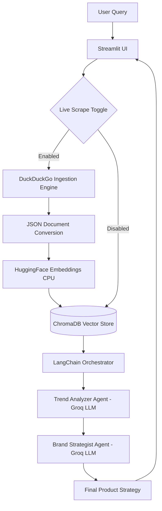
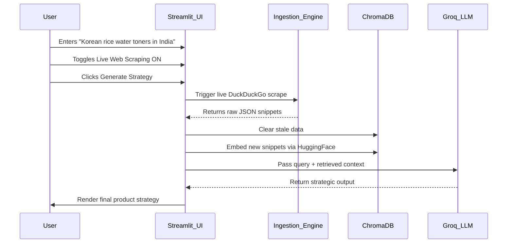

# MarketSense AI

## Overview

**MarketSense AI** is a centralized, AI-native consumer intelligence pipeline designed to accelerate operational speed and product strategy generation across Think9's portfolio of consumer brands.

Instead of relying on static, manual market research, the system functions as an autonomous research layer. It programmatically ingests unstructured consumer signals such as search trends, forum complaints, and web discussions without relying on locked APIs. These signals are embedded into a localized vector database and processed through a Retrieval-Augmented Generation (RAG) framework that powers specialized AI agents.

Running on **Groq's high-speed cloud infrastructure**, these agents analyze raw consumer data and generate actionable product strategies specifically tailored for the Indian market.

[](https://www.python.org/)
[](https://www.langchain.com/)
[](https://www.trychroma.com/)
[](https://ollama.com/)
[](https://streamlit.io/)

### Examples of Capabilities

1. **Trend Identification:** Aggregate web signals to identify rising ingredients such as Ashwagandha and Matcha before they reach mainstream Indian consumer segments.
2. **Pain Point Analysis:** Analyze unstructured consumer complaints about existing products, such as sticky white casts in humid-weather sunscreens, to identify formulation opportunities.
3. **Strategic Go-To-Market Formulation:** Generate influencer partnership strategies, positioning ideas, and retail hooks based on emerging consumer trends.

---

## Core Architecture

The system utilizes a modern, modular technology stack designed to scale across multiple brands while avoiding unnecessary local hardware requirements and external API dependencies.



### 1. Data Ingestion Layer

The ingestion layer uses the `ddgs` (DuckDuckGo Search) library to collect live consumer queries, search results, and relevant web discussions.

This approach reduces dependence on paid APIs and platform-specific access restrictions while allowing the system to dynamically generate research signals.

### 2. Vector Memory

MarketSense AI uses `ChromaDB` alongside HuggingFace's lightweight `all-MiniLM-L6-v2` embedding model.

The system clears stale collections during live scraping to prevent topic contamination between research queries. Embeddings are configured to run on the CPU, keeping the system compatible with a wider range of hosting environments.

### 3. Agentic Intelligence

The intelligence layer is built using **LangChain Expression Language (LCEL)**.

The orchestrator routes retrieved context through query-aware specialized agents such as the **Trend Analyzer** and **Brand Strategist**.

LLM inference is powered by Groq using the `llama-3.3-70b-versatile` model, providing high-speed inference without requiring expensive local GPU infrastructure.

### 4. User Interface

A `Streamlit` dashboard provides the primary user interface.

The LangChain orchestrator is cached in Streamlit session state, allowing brand managers to trigger on-demand web research and strategy generation without interacting directly with the backend pipeline.

---

## Technology Stack

| Component              | Technology                     | Strategic Purpose                                                  |
| ---------------------- | ------------------------------ | ------------------------------------------------------------------ |
| **Frontend UI**        | Streamlit                      | Rapid internal tooling deployment for non-technical brand managers |
| **Ingestion Pipeline** | `ddgs`, BeautifulSoup4         | API-agnostic web research and data collection                      |
| **Vector Database**    | ChromaDB (SQLite)              | Persistent local memory for similarity search                      |
| **Embeddings**         | HuggingFace `all-MiniLM-L6-v2` | Lightweight text vectorization running on CPU                      |
| **LLM Inference**      | Groq Cloud                     | High-speed Llama inference without local GPU requirements          |
| **Orchestration**      | LangChain (LCEL)               | Modular pipeline construction and agent orchestration              |

---

## Project Structure

```text
marketsense_ai/
├── data/
│   ├── raw/                 # Temporarily stores scraped JSON datasets
│   ├── processed/           # Processed analytical outputs
│   └── vector_store/        # Local ChromaDB SQLite storage
├── ingestion/
│   ├── trend_scraper.py     # API-free DuckDuckGo ingestion engine
│   └── data_pipeline.py     # Embedding and vector-store management
├── agents/
│   ├── orchestrator.py      # Main LCEL pipeline connecting Groq and ChromaDB
│   └── strategist.py        # Brand Strategist agent
├── ui/
│   └── dashboard.py         # Streamlit web interface
├── utils/
│   ├── config.py            # Centralized configuration parameters
│   └── logger.py            # Standardized timestamped system logging
├── main.py                  # End-to-end execution entry point
├── requirements.txt         # Python dependencies
└── README.md                # Project documentation
```

---

## Accessing the Dashboard

The MarketSense AI dashboard is available through Streamlit Community Cloud:

**[🔗 Launch MarketSense AI Dashboard](https://marketsense-ai-anikait.streamlit.app/)**

> **Note:** If the application has been inactive for several days, it may take 1–2 minutes to start when accessed for the first time.

---

## Usage Example & Workflow

### The Scenario

A Think9 brand manager wants to explore launching a Korean-inspired skincare product tailored for the Indian climate.

### The Execution Workflow



### The Output

The system generates a focused strategy by extracting key insights from the collected consumer signals:

* **Formulation Adjustments:** Adding ingredients such as Niacinamide to address humidity-induced oiliness.
* **Packaging:** Recommending mist-spray bottles for easier application in hot weather.
* **Marketing Hooks:** Positioning the product as a "cooling, lightweight" alternative to heavier Western toners.

---

## Design Goals

### 1. API Independence

By utilizing keyless web research, the system reduces vendor lock-in and exposure to arbitrary API pricing changes from external data providers.

### 2. Computational Efficiency

Running embeddings on the CPU while using Groq for LLM inference allows the architecture to operate without requiring specialized local GPU infrastructure.

### 3. Modularity

The LCEL architecture allows the underlying LLM to be replaced or additional specialized agents to be introduced without requiring a complete rewrite of the pipeline.

For example, additional agents such as a **Compliance Checker**, **Competitor Analyst**, or **Market Opportunity Analyst** can be integrated into the existing architecture.

### 4. Data Isolation

The `reset=True` behavior during live scraping prevents unrelated research queries from contaminating the vector memory, helping maintain high-fidelity retrieval for each research session.

---

## 30-Day Implementation Roadmap

This repository represents the functional **Minimum Viable Product (MVP)**. The roadmap for integrating MarketSense AI into the Think9 enterprise ecosystem includes:

### Week 1 — Scale Data Ingestion

* Scale the `ddgs` ingestion engine.
* Introduce asynchronous scheduled jobs.
* Expand coverage across 50+ localized product categories.
* Improve query generation and deduplication.

### Week 2 — Refine RAG & Intelligence

* Implement Maximal Marginal Relevance (MMR) retrieval.
* Improve metadata filtering and chunking.
* Add an FSSAI/AYUSH Compliance Agent.
* Improve agent orchestration and response consistency.

### Week 3 — Internal Deployment

* Deploy the Streamlit application internally on cloud infrastructure.
* Add multi-brand selection.
* Implement brand-specific knowledge bases.
* Introduce Human-in-the-Loop (HITL) feedback logging.

### Week 4 — Production Infrastructure

* Containerize the architecture using Docker.
* Separate ingestion, retrieval, and inference services.
* Implement secure data partitioning.
* Add monitoring, logging, and health checks.

---

## Future Opportunities

Potential extensions include:

* **Multimodal Analysis:** Integrate vision models to analyze social media aesthetics, packaging designs, and visual product trends.
* **Automated Trend Alerts:** Notify brand managers when specific consumer keywords or pain points begin increasing in relevance.
* **Competitor Benchmarking:** Create a dedicated agent to analyze competitor pricing, positioning, and consumer sentiment.
* **Real-Time Consumer Intelligence:** Continuously monitor emerging consumer conversations across product categories.
* **Automated Executive Reports:** Generate scheduled market intelligence summaries for decision-makers.
* **Product Opportunity Scoring:** Rank potential product opportunities based on consumer demand, pain points, and competitive gaps.

